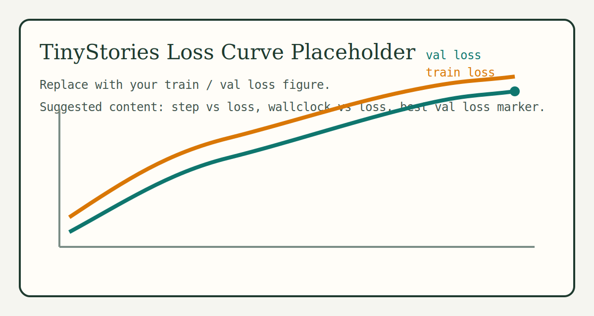
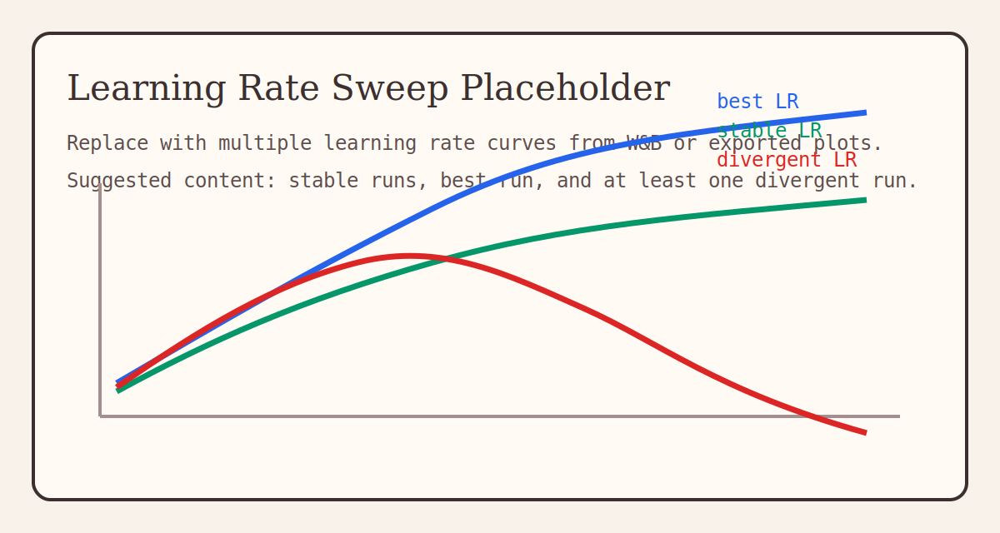
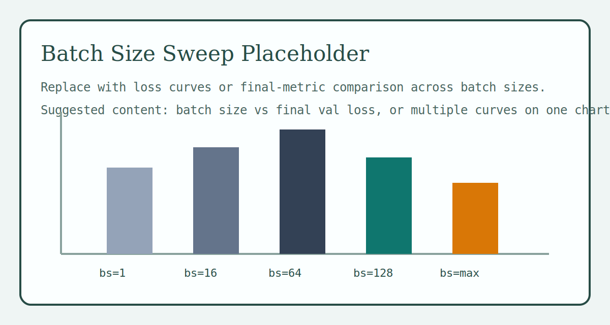
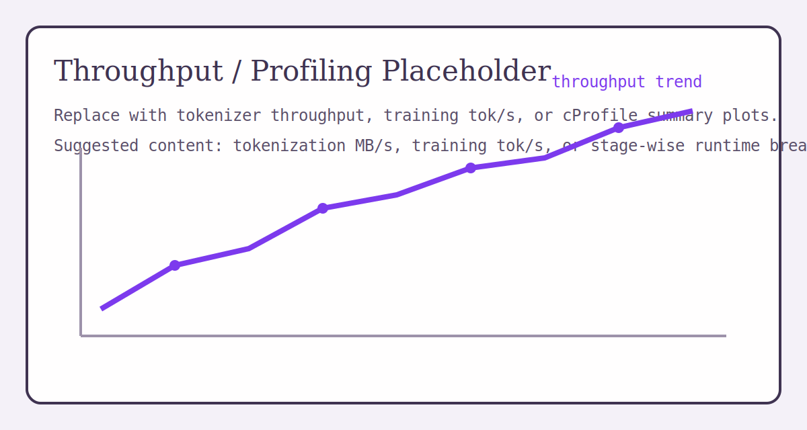

# MiniTransformer From Scratch

This repository is a personal implementation project built on top of Stanford CS336 Assignment 1. It turns the assignment components into a runnable small-scale language model training stack, from raw text to experiment tracking.

Current scope:

- byte-level BPE tokenizer training and text encoding
- Transformer language model in PyTorch
- custom AdamW, learning rate scheduling, and training loop
- `np.memmap`-based token dataset loading
- checkpointing, automatic resume, and checkpoint retention
- W&B logging, learning rate sweep, and batch size sweep

For full training commands, see [RUN.md](./RUN.md).

## Setup

PowerShell:

```powershell
& C:\Software\Miniconda\shell\condabin\conda-hook.ps1
conda activate C:\Software\Miniconda\envs\cs336
uv sync
```

Linux:

```bash
conda activate cs336
uv sync
```

Download TinyStories:

```bash
mkdir -p data
cd data

wget https://huggingface.co/datasets/roneneldan/TinyStories/resolve/main/TinyStoriesV2-GPT4-train.txt
wget https://huggingface.co/datasets/roneneldan/TinyStories/resolve/main/TinyStoriesV2-GPT4-valid.txt

cd ..
```

## Quick Start

Run tests:

```bash
uv run pytest
```

Full TinyStories pipeline:

```bash
bash scripts/run_tinystories_train.sh \
  --conda-env cs336 \
  --use-wandb
```

Train directly from tokenized `.bin`:

```bash
bash scripts/run_tinystories_train.sh \
  --conda-env cs336 \
  --skip-bpe \
  --skip-tokenize \
  --train-bin data/tinystories_train.bin \
  --val-bin data/tinystories_val.bin \
  --data-dtype uint16
```

Resume training:

```bash
bash scripts/resume_training.sh \
  --conda-env cs336 \
  --run-dir runs/tinystories_base
```

Learning rate sweep:

```bash
bash scripts/lr_sweep.sh \
  --conda-env cs336 \
  --train-data data/tinystories_train.bin \
  --val-data data/tinystories_val.bin \
  --use-wandb
```

Batch size sweep:

```bash
bash scripts/batch_sweep.sh \
  --conda-env cs336 \
  --train-data data/tinystories_train.bin \
  --val-data data/tinystories_val.bin \
  --use-wandb
```

Single-minibatch sanity check:

```bash
uv run python scripts/overfit_single_batch.py \
  --train-data data/tinystories_train.bin \
  --data-dtype uint16 \
  --vocab-size 10000
```

## Training Notes

A typical run directory contains:

```text
runs/<experiment_name>/
|- best.pt
|- latest.pt
|- final.pt
|- step_XXXXXXXX.pt
|- run_config.json
`- wandb/
```

Checkpoint policy:

- periodic `step_*.pt` files keep only the latest `3` by default
- `best.pt`, `latest.pt`, `final.pt`, and `interrupted_step_*.pt` are kept separately
- resume prefers `latest.pt` first

## Results

You can fill in the final metrics here:

| Metric | Value |
| --- | --- |
| Best validation per-token loss | `TODO` |
| Best hyperparameter setting | `TODO` |
| Peak training throughput | `TODO` |
| Tokenizer training / encoding speed | `TODO` |
| W&B run URL | `TODO` |

### TinyStories Train / Val Loss



### Learning Rate Sweep



### Batch Size Sweep



### Throughput / Profiling Summary



## Notes

- start from [RUN.md](./RUN.md) if you want the full baseline commands
- tokenizer profiling notes are in [`scripts/README.md`](./scripts/README.md)
- the original course handout is in [`cs336_spring2025_assignment1_basics.pdf`](./cs336_spring2025_assignment1_basics.pdf)
- license: [`LICENSE`](./LICENSE)
